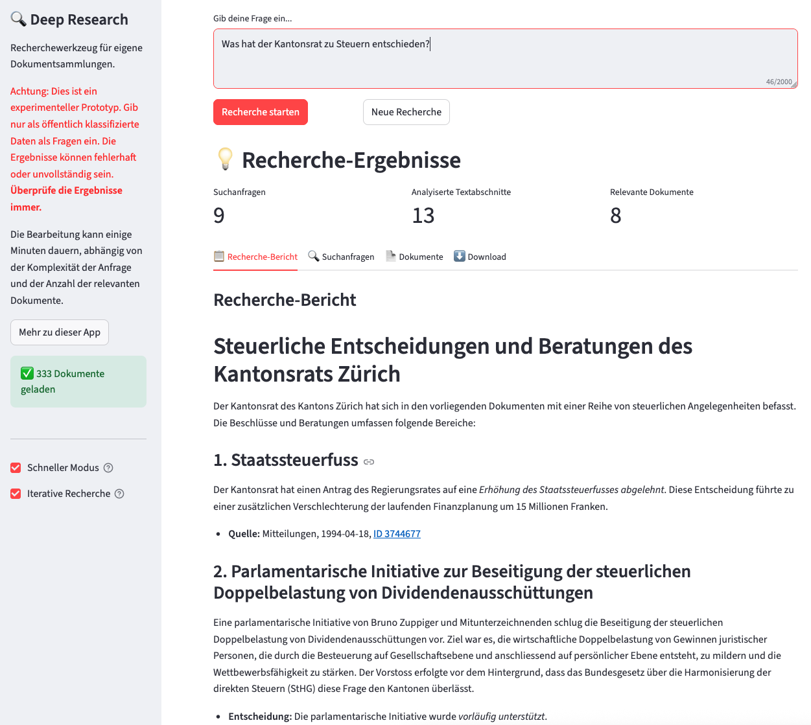

# Deep Research KTZH

**Powerful, automated research and analysis across your own document collections.**



## Features

- **Advanced Document Analysis** - Perform thorough, multi-step research across all your data.
- **Iterative Workflow** - The app can run multiple research rounds to find more documents and deepen insights for your final report.
- **Fast Mode** - Instantly generate a first draft or quick insights.
- **DOCX Export** - Export your results as a well-formatted Microsoft Word document for review and sharing.

### Why not use Deep Research functionality of commercial providers instead?

- **Ensure only your documents are considered for answers** - Eliminate the risk of contamination from external sources or web content that could introduce irrelevant or inaccurate information into your research.
- **Control the workflow and prompting** - Customize every step of the research process, from query generation to final report synthesis, without being locked into predefined workflows.
- **Control the model selection** - Since we use Openrouter you can choose from more than 450+ LLMs to exactly match your workflow needs.
- **Get faster answers** - By carefully selecting the fastest and most suitable model for every step and parallelizing calls, we achieve very fast results.
- **Potentially apply to private data** - You can easily adapt the code to use on-premises LLMs, thereby keeping sensitive documents offline and secure.

## Installation

```bash
# Clone the repository
git clone https://github.com/statistikZH/deep-research.git
cd deep-research

# Install uv and dependencies
pip3 install uv
uv venv
source .venv/bin/activate
uv sync
```

## Configuration

### Environment Variables

Create a `.env` file in the project root directory with your OpenRouter API key:

```bash
# Create the .env file
touch .env
```

Add your OpenRouter API key to the `.env` file:

```bash
OPENROUTER_API_KEY=your_openrouter_api_key_here
```

You can obtain an OpenRouter API key by signing up at [openrouter.ai](https://openrouter.ai/).

### App Configuration

Edit `02_app/config_app.yaml` to adjust:

- Model names/parameters for each step
- Search limits and thresholds
- API endpoints and connection options
- Embedding model settings
- Max parallel LLM calls for speed

**Restart the app after config changes.**

The app uses different model configurations for development/fast mode vs production:

- **Development/Fast Mode:** Uses `gemini-2.5-flash-lite-preview` for all tasks with reduced search limits
- **Production Mode:** Uses tiered models (`flash-lite` for queries, `flash` for analysis and complex tasks). We also get very good results with Claude 4 models for the final analysis and report writing step.

## Usage

If you haven't already, [install Docker on your machine](https://docs.docker.com/get-started/get-docker/). Then, start the Weaviate Docker container with the search index:

```bash
cd 01_data
docker compose up -d
```

Start the Streamlit app:

```bash
streamlit run main.py
```

## Example Data

A sample open dataset is included in the `01_data/` directory to help you get started and demonstrate how to structure and index data for hybrid search.

## Adapting to Your Data

- Check out the notebook `01_data/01_index_data.ipynb` to see how data is prepared and indexed as a Weaviate search index.
- Copy the dataframe with your unchunked documents to `02_app/_data_input`. See example `02_KRP_selec.parq` as reference how this works.
- Edit `prompts.py` to match your content and data schema.
- Edit `main.py` to adapt the UI to your use case.

## Project Information

This app implements the [Deep Research pattern](https://openai.com/index/introducing-deep-research/)—not on web search, but over your own data collection.\
Built from scratch (no agent frameworks or heavy abstractions), for maximum workflow control. We use this pattern internally on various use cases like research over government decisions (“Regierungsratsbeschlüsse”) and court decisions.

### Preprocessing

- **Chunking:** Documents split into 500-token segments, 100-token overlap (easily adjustable).
- **Embedding:** Each chunk embedded with `intfloat/multilingual-e5-small` via Sentence Transformers (configurable).
- **Indexing:** Chunks indexed for hybrid search in a [Weaviate](https://weaviate.io/) Docker container.

### Workflow

- **Query Generation:** Generate search queries from the user's input using a fast and inexpensive model (Gemini 2.5 Flash Lite).
- **Hybrid Search:** Use Weaviate's hybrid search with all queries, including autocut functionality to limit results based on score discontinuities.
- **Deduplication:** Deduplicate retrieved results and filter out previously processed chunks in iterative workflows.
- **Relevance Checking:** Check all retrieved chunks in parallel for relevance to the user's query using Gemini Flash 2.5.
- **Full Document Analysis:** Analyze the full text of documents containing relevant chunks in parallel. Summarize findings with Gemini Flash 2.5.
- **Iterative Workflow (optional):** If enabled by the user, check if there is sufficient insight to answer the question. Otherwise, start a new iteration: process more queries, check relevance, and gather new insights.
- **Final Report Generation:** Use Gemini 2.5 Flash to synthesize all insight summaries and produce the final report.

## Project Team

**Chantal Amrhein**, **Patrick Arnecke** – [Statistisches Amt Zürich: Team Data](https://www.zh.ch/de/direktion-der-justiz-und-des-innern/statistisches-amt/data.html)

## Feedback and Contributing

We welcome feedback and contributions! [Email us](mailto:datashop@statistik.zh.ch) or open an issue or pull request.

We use [`ruff`](https://docs.astral.sh/ruff/) for linting and formatting.

Install pre-commit hooks for automatic checks before opening a pull request:

```bash
pre-commit install
```

## License

This project is licensed under the MIT License. See the [LICENSE](LICENSE) file for details.

## Disclaimer

This software (the Software) incorporates machine learning models and analytical tools for document analysis and has been developed according to and with the intent to be used under Swiss law. Please be aware that the EU Artificial Intelligence Act (EU AI Act) may, under certain circumstances, be applicable to your use of the Software. You are solely responsible for ensuring that your use of the Software as well as of the underlying models complies with all applicable local, national and international laws and regulations. By using this Software, you acknowledge and agree (a) that it is your responsibility to assess which laws and regulations, in particular regarding the use of AI technologies, are applicable to your intended use and to comply therewith, and (b) that you will hold us harmless from any action, claims, liability or loss in respect of your use of the Software.
